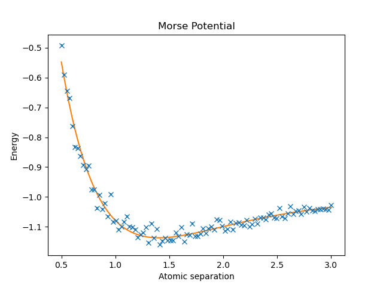

# vmc-hydrogen
Variational Monte Carlo simulation of hydrogen systems and Morse potential estimation using Metropolis sampling.

# Variational Monte Carlo Simulation of Hydrogen Systems

A computational physics project implementing Variational Monte Carlo (VMC) methods in Python to estimate ground-state properties of hydrogen systems and recover the Morse potential for the hydrogen molecule.

---

## Overview

This project applies Variational Monte Carlo techniques to progressively more complex quantum systems:

1. **1D Quantum Harmonic Oscillator**
   Used to validate the numerical methods and Metropolis sampling implementation.

2. **3D Hydrogen Atom**
   Used to recover the known ground-state energy and optimise a variational parameter.

3. **3D Hydrogen Molecule**
   Used to estimate the molecular potential curve and fit the Morse potential.

The project combines Monte Carlo integration, Metropolis sampling, finite difference methods, and variational optimisation to approximate solutions to the time-independent Schrödinger equation.

---

## Motivation

Analytical solutions to the Schrödinger equation only exist for a limited number of quantum systems. Variational Monte Carlo methods provide a computational approach for approximating ground-state energies by combining:

* the variational principle,
* stochastic sampling,
* and numerical optimisation.

This project explores these techniques in increasingly high-dimensional systems, progressing from a one-dimensional validation problem to a six-dimensional molecular configuration space.

---

## Physics Background

The variational principle states that for a trial wavefunction $$\psi_T\$$,

$$E[\psi_T]=\frac{\langle \psi_T | H | \psi_T \rangle}{\langle \psi_T | \psi_T \rangle}$$

minimising the expectation value over the variational parameters gives an approximation to the ground-state energy.

Expectation values are estimated numerically using Monte Carlo integration, with configurations sampled from the probability density

$$\rho(q)=|\psi_T(q)|^2$$

using the Metropolis algorithm.

A proposed move is accepted with probability

$$P(q\rightarrow q')=\min\left(1,\frac{\rho(q')}{\rho(q)}\right)$$

---

## Numerical Methods

The implementation includes:

* Metropolis Markov Chain Monte Carlo sampling
* Monte Carlo integration of Hamiltonian expectation values
* Fourth-order finite difference approximations of Laplacians
* Gradient descent optimisation of variational parameters
* Morse potential fitting for molecular energy curves

The simulations were implemented in Python using NumPy, SciPy, and Matplotlib.

---

## Systems Studied

### 1D Quantum Harmonic Oscillator

The harmonic oscillator was used as a validation system for the Metropolis sampling and finite difference methods. Numerical energy eigenvalues for the first five eigenstates were recovered and compared with theoretical values.

### 3D Hydrogen Atom

A variational wavefunction ansatz of the form

$$\psi(\mathbf{r})=e^{-\theta |\mathbf{r}|}$$

was used to approximate the ground-state wavefunction of the hydrogen atom.

The optimisation recovered the expected value:

```text
θ = 1.0000007 ± 0.0000008
```

which is consistent with the theoretical result.

### 3D Hydrogen Molecule

The hydrogen molecule calculation extended the system to a six-dimensional configuration space. A three-parameter trial wavefunction was optimised using gradient descent while expectation values were estimated through Monte Carlo integration.

The resulting molecular energy curve was fitted to the Morse potential:

$$V(r)=D\left(1-e^{-a(r-r_0)}\right)^2-D+2E_{\mathrm{single}}$$

Estimated parameters:

```text
Bond length:          r₀ = 1.40 ± 0.01
Dissociation energy:  D  = 0.137 ± 0.003
Morse parameter:      a  = 1.24 ± 0.02
```

The estimated bond length agrees closely with the expected physical value.

---

## Example Results

### Morse Potential Fit



### Hydrogen Atom Ground-State Density


### Hydrogen Molecule Density Projection


---

## Repository Structure

```text
src/        Core simulation code
figures/    Generated plots and visualisations
report/     Full written report
```

---

## Installation

```bash
pip install -r requirements.txt
```

---

## Running Simulations

Example:

```bash
python scripts/run_hydrogen_molecule.py
```

---

## Limitations

The uncertainty estimates currently use the standard error of the sampled local energies. Since Metropolis sampling generates correlated Markov chains, the quoted uncertainties may underestimate the true error.

Potential improvements include:

* estimating integrated autocorrelation times,
* computing effective sample sizes,
* improving proposal distributions,
* and implementing parallelised sampling.

---

## Future Improvements

Possible extensions include:

* adaptive proposal distributions,
* autocorrelation analysis,
* parallel Metropolis chains,
* analytic local energy calculations,
* alternative variational wavefunction ansätze,
* GPU acceleration,
* and extensions to more complex many-body systems.

---

## Technologies

* Python
* NumPy
* SciPy
* Matplotlib
* Monte Carlo methods
* Numerical optimisation
* Finite difference methods

---

## Report

A full technical report discussing the theory, numerical methods, implementation details, and results is included in:

```text
report/computational_physics_report.pdf
```
